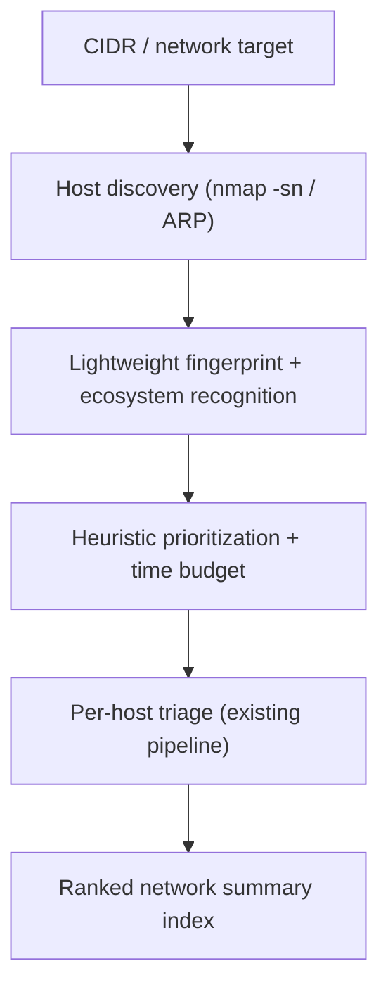

# Roadmap: Intelligent Network Triage

This document captures the long-term vision for turning the agent from a per-target
scanner into one that can be pointed at an entire network and assess it intelligently.
It is a design/roadmap document, not a description of current behavior.

## Where we are today

The agent accepts one or more explicit targets (IP, hostname, or CIDR) and triages
each independently, writing one report per target. A CIDR (e.g. `192.168.1.0/24`) is
handled naively: it is passed to nmap as a single scan and produces one combined
report. There is no host discovery, no prioritization, and no time budgeting.

## The vision

Point the agent at a network and have it:

1. Discover which hosts are actually alive.
2. Recognize the kind of environment it is in (the "ecosystem").
3. Decide, within a realistic time budget, which hosts are most worth triaging.
4. Triage those hosts and produce a ranked, network-level summary.

## Phases

### Phase 1 - Host discovery
- Use a fast sweep (`nmap -sn`, ARP on local segments) to enumerate live hosts from a
  CIDR before any version scanning.
- Output: a list of live host IPs to feed the rest of the pipeline.

### Phase 2 - Ecosystem / fingerprint recognition
- Lightweight per-host fingerprint: open ports, OS guess, device type, banner hints.
- Classify the environment (e.g. corporate LAN, server subnet, IoT/OT segment) so the
  agent "recognizes the ecosystem it is in" and can tune prioritization accordingly.

### Phase 3 - Heuristic prioritization
- Score each host by likely exploitability rather than treating all hosts equally.
- Candidate signals: exposed high-risk services (SMB, RDP, Telnet, legacy SSL/TLS),
  unusually high open-port counts, end-of-life or outdated software versions,
  internet-reachable management interfaces.
- Selection modes: triage the top-N most-likely hosts, "all but one", or every host.

### Phase 4 - Time / resource budgeting
- Estimate run time from `host_count x NVD throttle x MAX_SERVICES` and the nmap scan
  cost, then let the user pick a budget (e.g. "finish within 30 minutes").
- The agent balances depth vs breadth: fewer hosts scanned deeply, or more hosts
  scanned shallowly, to fit the budget. This directly addresses the "balance
  realistically how long it might take" requirement.

### Phase 5 - Per-host triage at scale
- Reuse the existing planner -> nmap -> CVE -> report pipeline per host.
- Investigate bounded concurrency, carefully reconciled with the NVD rate limit
  (the throttle in `src/agent/nvd.py` is global and would need to remain respected
  across parallel workers).

### Phase 6 - Network summary index
- Aggregate per-host results into a single ranked summary (hosts ordered by risk),
  in addition to the individual per-host reports. This is the deferred
  "summary index of the run".

## Architecture impact

- New graph nodes: `discover_hosts`, `fingerprint`, `prioritize`, `summarize`.
- `AgentState` (`src/agent/state.py`) gains a list of hosts and per-host scores.
- A batch orchestrator above `run_triage` to manage the host queue and budget.

## Constraints and open questions

- NVD rate limit interaction at scale: even with an API key (~50 req / 30s),
  hundreds of hosts x multiple services per host is a large request volume.
- nmap timeout: per-host scanning needs different timeout handling than a single
  range scan; the current 120s timeout is range-unfriendly.
- Permission and legal scoping: discovery across a network must respect that only
  authorized targets are scanned.
- Scoring methodology: the heuristic needs validation against real findings to avoid
  deprioritizing hosts that actually carry critical vulnerabilities.
